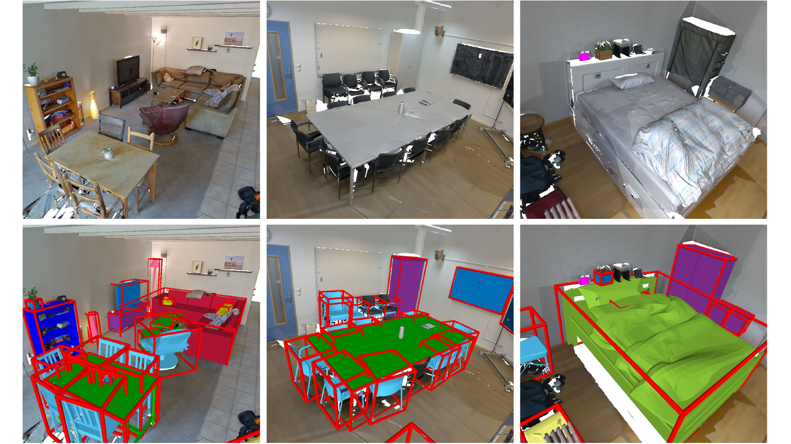

# The SCANnotate++ Dataset

<p align="center">

</p>

This repository provides CAD model and pose annotations for objects in the ScanNet++v1 dataset. The annotations were automatically generated 
using [SCANnotate](https://github.com/stefan-ainetter/SCANnotate) and [HOC-Search](https://github.com/stefan-ainetter/HOC-Search). 
The quality of these annotations was verified in several verification passes, 
with manual re-annotations performed for outliers to ensure that final annotations are of high quality. 

## Details about Annotations

For the public [ScanNet++v1 dataset](https://kaldir.vc.in.tum.de/scannetpp/), we provide:

* `5290` CAD model annotations for objects in the ScanNet++v1 dataset
* Accurate 9D pose for each CAD model
* 3D semantic object instance segmentation corresponding to the annotated objects
* Extracted view parameters (selected RGB-D images and camera poses) for each object, which
can be used for image-based optimization

## CAD Model and Pose Annotations
Our annotations for ScanNet++v1 are provided as `.pkl` files, which 
contain additional information about the annotated objects, e.g. view parameters for render-and-compare and the 
corresponding 3D instance segmentation of the pointcloud data.

**Note** that in order to use any of the provided annotations correctly, it is necessary to preprocess the ShapeNet 
CAD models (center and scale-normalize all CAD models) as explained below, 
to generate clean CAD models which are then compatible with our annotations.


### Preliminaries: Download ShapeNet and ScanNet++v1 examples
* Download the ScanNet++v1 example scene [here](https://cloud.tugraz.at/index.php/s/NA7icqiJ5SeNSA6/download?path=%2FScannotatepp%2FScanNetpp_example&files=30966f4c6e.zip). Extract the data
and copy them to `./data/ScanNetpp/data`. Note that by downloading this example data
you agree to the [ScanNet++ Terms of Use](https://kaldir.vc.in.tum.de/scannetpp/static/scannetpp-terms-of-use.pdf). 
To download the full ScanNet++ dataset follow the instructions on the [ScanNet++ webpage](https://kaldir.vc.in.tum.de/scannetpp/).

* Download the [ShapenetV2](https://huggingface.co/datasets/ShapeNet/ShapeNetCore) dataset by signing up
on the website. Extract ShapeNetCore.v2.zip to `./data/ShapeNet`.

* Download our annotations for the ScanNet++v1 dataset 
[here](https://cloud.tugraz.at/index.php/s/NA7icqiJ5SeNSA6/download?path=%2FScannotatepp%2FScannotatepp_annotations&files=ScanNetpp_annotations.zip). Extract the data and copy them to
`./data/ScanNetpp/annotations`.

#### Preprocessing ShapeNet CAD Models
To center and scale-normalize the downloaded ShapeNet CAD models, run:
```bash
bash run_shapenet_prepro.sh gpu=0
```
The `gpu` argument specifies which GPU should be used for processing. 
By default, code is executed on CPU.

After the above-mentioned steps the `./data` folder should contain the following directories:
```text
- data
    - ScanNetpp
        - annotations
            - 30966f4c6e
            - ...
        - data
            - 30966f4c6e
    - ShapeNet
        - ShapeNet_preprocessed            
        - ShapeNetCore.v2
```

#### Installation Requirements and Setup

* Clone this repository. Install PyTorch3D by following the instructions from the
[official installation guide](https://github.com/facebookresearch/pytorch3d/blob/main/INSTALL.md).

After installing Pytorch3D, run the following command:
```bash
pip install scikit-image matplotlib imageio plotly opencv-python open3d trimesh==3.10.2
```

### Visualization of Annotations
Use the following command to visualize the annotations: 
```bash
bash visualize_annotations.sh
```

## Citation
To create these annotations, we used the CAD model retrieval pipeline from 
[SCANnotate](https://github.com/stefan-ainetter/SCANnotate), but replaced the exhaustive
CAD retrieval stage with [HOC-Search](https://github.com/stefan-ainetter/HOC-Search). 
If you use any of the provided code or data, please cite the following works:

Scannotate:
```bibtex
@inproceedings{ainetter2023automatically,
  title={Automatically Annotating Indoor Images with CAD Models via RGB-D Scans},
  author={Ainetter, Stefan and Stekovic, Sinisa and Fraundorfer, Friedrich and Lepetit, Vincent},
  booktitle={Proceedings of the IEEE/CVF Winter Conference on Applications of Computer Vision},
  pages={3156--3164},
  year={2023}
}
```
HOC-Search:
```bibtex
@inproceedings{ainetter2024hocsearch,
      title={HOC-Search: Efficient CAD Model and Pose Retrieval From RGB-D Scans}, 
      author={Stefan Ainetter and Sinisa Stekovic and Friedrich Fraundorfer and Vincent Lepetit},
      booktitle = {International Conference on 3D Vision (3DV)},
      year={2024}
}
```
